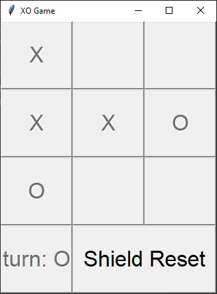

# XO Game (Tic-Tac-Toe)

A clean Python Tic-Tac-Toe game with a console interface, a Tkinter GUI, and simple AI.

## Features

- Console modes: Player vs Player, Player vs AI, AI vs AI
- Tkinter GUI (Player vs Player)
- Smart AI with simple rule-based strategy
- Game logging to CSV

## Install (clone from GitHub)

```bash
git clone https://github.com/omidNomiri/XO_Game.git
cd XO_game
```

## Requirements

- Python 3.9+
- Tkinter (usually included with Python on Windows/macOS; on Linux you may need `python3-tk`)

## Install dependencies

There are no external dependencies, but you can still run:

```bash
pip install -r requirements.txt
```

## Run (Console Menu)

```bash
python main.py
```

## Run (GUI Only)

```bash
python gui.py
```

## How to Play (Console)

- Enter a number 1-9 to place your symbol.
- The guide board shows the position mapping:

```bash
 1 | 2 | 3
---+---+---
 4 | 5 | 6
---+---+---
 7 | 8 | 9
```

## AI Strategy

The smart AI follows this priority:

1. Win if possible
2. Block opponent's win
3. Take center
4. Take a corner
5. Choose any remaining move

## Logging

Finished console games are stored in:

```bash
logs_shield.csv
```

Columns:

- `Timestamp`
- `GameMode`
- `Winner`
- `MoveHistory`
- `FinalBoardState`

## Project Structure

- `main.py` — console menu and game loop
- `game_logic.py` — board logic and win checks
- `ai_engine.py` — AI move selection
- `gui.py` — Tkinter GUI
- `logger.py` — CSV logging
- `requirements.txt` — dependency list (empty except for notes)

## Project example

Game GUI


## Idea for future features

### AI Model

add ai model like mini max or anything you know

### Better GUI

this gui so simple and don't have any beauty and some functions not implemented
